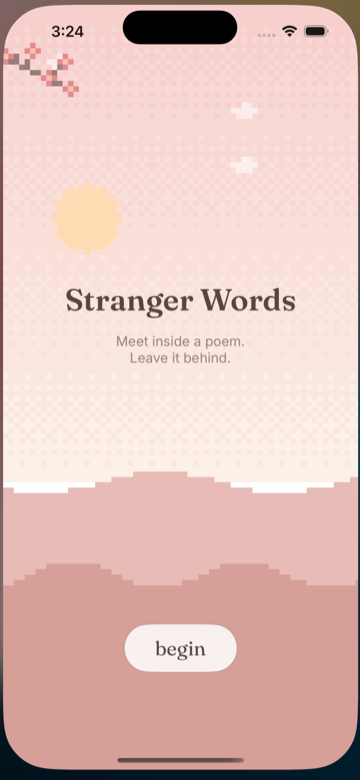
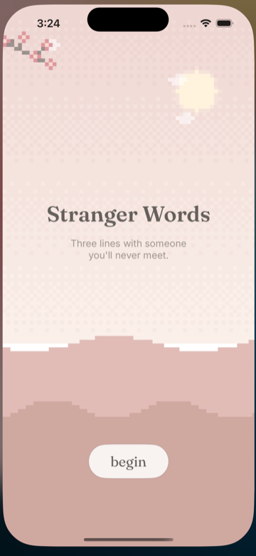
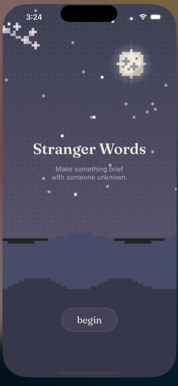

# Stranger Words

An anonymous, ephemeral iOS app for writing a tiny poem with someone you'll
never meet, then letting it go. (Repo, Go module, and Xcode target are named
`strangewords`/`Strangewords`.)

- **Current status (start here):** [`docs/STATUS.md`](docs/STATUS.md)
- **Intent / philosophy:** [`brief.v4.md`](brief.v4.md)
- **Build plan:** [`plan.v1.md`](plan.v1.md)

## Screens

The procedural pixel-art scene shifts with your local time of day.

| Morning | Afternoon | Night |
|:---:|:---:|:---:|
|  |  |  |

## Layout

- `server/` — Go coordination backend (HTTPS + Redis; APNs later)
- `ios/` — SwiftUI app (generated from `ios/project.yml` via XcodeGen)

## Run the backend

```sh
cd server
make run          # starts local Redis (docker) + the Go service on :8080
# or: go test ./...   to run the suite (no external services; uses miniredis)
```

## Easiest: live test against the robot poet

One command brings up Redis + the backend + the robot poet **and** builds and
launches the app on a simulator:

```sh
./live_test.sh                # uses your local time for the theme
./live_test.sh --night        # force a theme: --morning | --afternoon | --night
./live_test.sh --keep         # leave the backend running after you quit
```

Then tap **begin** in the simulator — you'll be matched with the robot, and the
poem appears in the script's terminal as you write it together. Ctrl-C tears
everything down (nothing is kept).

If you'd rather manage the simulator yourself, the backend+robot piece is also
available on its own:

```sh
./run_test_server_and_robot_poet_friend.sh    # flags: --once, --keep
```

## Run the iOS app

Requires Xcode 16+ and [XcodeGen](https://github.com/yonom/XcodeGen) (`brew install xcodegen`).

Easiest — build and launch on simulators with one command:

```sh
./run.sh                  # ONE simulator, mock mode — the everyday dev loop:
                          #   on-device stranger auto-replies, dev toggle on
./run.sh --solo           # one simulator against a real backend (+ robot poet)
./run.sh --two            # two simulators — be both strangers yourself (backend)
./run.sh --night          # force a theme: --morning | --afternoon | --night
```

Re-run `./run.sh` anytime to rebuild and relaunch with your latest changes.

**Mock mode** (the default, or `--mock` / `SW_LOCAL_MOCK=1`) needs no backend,
Redis, or robot: it matches you instantly with a simulated stranger who writes
its lines after a short pause, then completes and dissolves — the whole arc on
one simulator. Dev controls (a chip that cycles the time-of-day backdrop) are on
in every `./run.sh` launch.

Or open it in Xcode directly:

```sh
cd ios
xcodegen generate && open Strangewords.xcodeproj
```

The app talks to `http://127.0.0.1:8080` (the simulator shares the host
network). Start the backend first.

### Ways to test both sides

- **Just you (default):** `./run.sh` — one simulator, an on-device stranger
  auto-replies. No backend needed.
- **You + robot poet:** terminal 1 `./run_test_server_and_robot_poet_friend.sh`,
  terminal 2 `./run.sh --solo`, then tap **begin** in the simulator.
- **You + you:** start a backend (`cd server && make run`), then `./run.sh --two`
  and tap **begin** on both simulators.

## Manual two-participant runbook (Phase 3 acceptance)

The full live/async loop is verified across two clients:

1. Start the backend (`make run`).
2. Run the app on **two** simulators (or one simulator + `curl` as the second
   participant). Tap **begin** on the first — it shows the quiet waiting room.
3. Tap **begin** on the second — both are now matched into a poem.
4. Whoever's turn it is writes a line (a syllable hint guides, never blocks);
   the other sees the held-breath waiting state. Repeat for all three lines.
5. The completed poem reveals on both, then dissolves; nothing is kept.
6. **Async check:** background one client mid-poem; the other can still submit.
   Re-open the backgrounded client — it resumes the poem in its current state.
   (Push-driven re-engagement arrives in Phase 2.)
